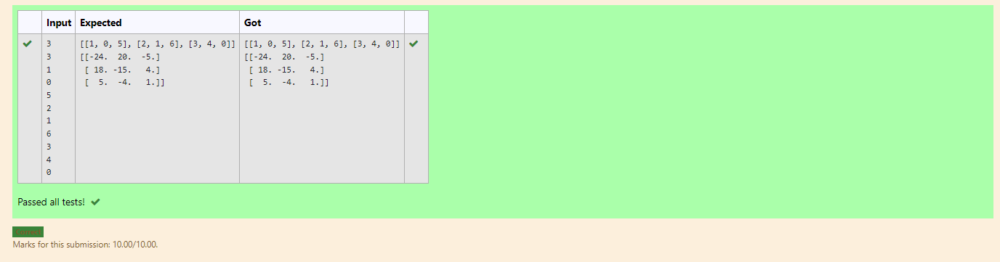

# Inverse-of-matrix

## AIM:inverse of the matrix

## ALGORITHM:
### Step 1: Import numpy as np.
### Step 2: Creat empty list.
### Step 3: From the append the matrix.
### Step 4: use inverse function. 
### Step 5: Print the program.


## PROGRAM:
```
import numpy as np
l1,l2=[],[]
r=int(input())
c=int(input())
for i in range (r):
    for j in range (c):
        num=int(input())
        l1.append(num)
    l2.append(l1)
    l1=[]
print(l2)
value1=np.array(l2)
inverse=np.linalg.inv(value1)
print(inverse)
```

## OUTPUT:


## RESULT:
Thus, the program is excuted.
